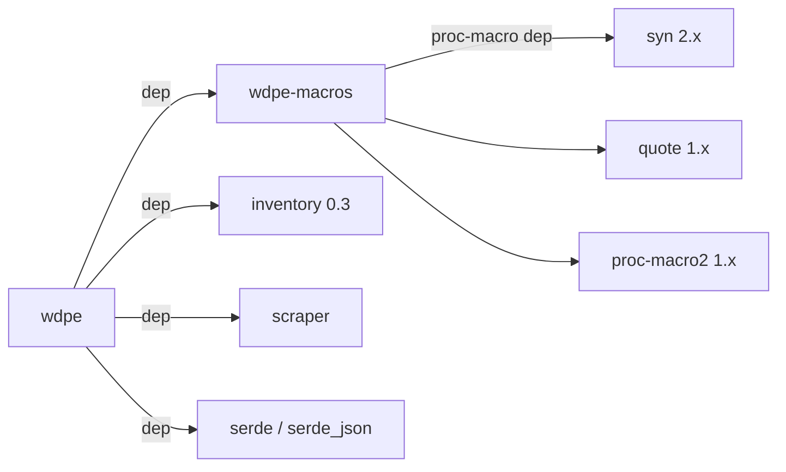
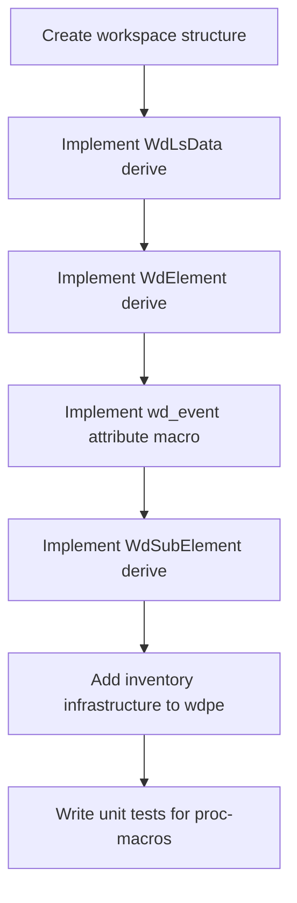
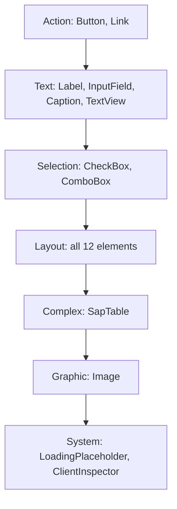

# Element Registration Improvement Plan — Proc-Macro + Inventory

> **Status: ✅ Completed** — All four phases have been implemented and merged.
> This document is retained as an architectural decision record (ADR).

## Completion Status

✅ **Phase 1**: Created `wdpe-macros` proc-macro crate with `WdLsData`, `WdElement`, `WdSubElement`, `wd_event` derives
✅ **Phase 2**: Migrated all eligible elements to proc-macro derives
✅ **Phase 3**: Replaced `register_elements!` with `element_wrapper_impls!` and inventory-based dispatch
✅ **Phase 4**: Removed old `macro_rules!` macros and cleaned up

### Elements NOT migrated (by design)

- `Custom` — pseudo-element with no DOM representation; uses `()` as `ElementLSData`
- `Unknown` — fallback element with `serde_json::Value` LsData; serves as catch-all
- `ClientInspector` — asymmetric Serialize/Deserialize serde requirements (`rename_all(serialize = "PascalCase")` + per-field `rename(deserialize = "N")`)
- ListBox variants — use `def_listbox_subset!` macro for shared inner struct (newtype) pattern

### Future Considerations

- `element_wrapper_impls!` macro still generates `ElementWrapper` and `ElementDefWrapper` enums statically. This could be replaced with an inventory-based approach to fully eliminate manual enum synchronization, at the cost of losing static dispatch.
- `trybuild` tests for proc-macro error cases (happy path + compile-error tests)

---

## 1. Executive Summary (Historical)

The `wdpe` (WebDynpro Parse Engine) crate currently uses 4 layered `macro_rules!` macros to define ~30 WebDynpro UI elements. While functional, this approach suffers from:

- **Redundant boilerplate** — identical `new()` constructors and event methods hand-written in 25+ files
- **Manual synchronization** — adding one element requires 4 coordinated edits (file, category re-export, import, `register_elements!`)
- **Opaque errors** — `macro_rules!` failures produce incomprehensible diagnostics
- **Outlier elements** — `Custom` and `ClientInspector` cannot use the macro system at all
- **Monolithic `ElementWrapper`** — a 32-variant enum with `#[allow(clippy::large_enum_variant)]`

**This plan replaces the entire `macro_rules!` system with:**

1. **`#[derive(WdElement)]`** — replaces `define_element_base!` and `define_element_interactable!`
2. **`#[derive(WdLsData)]`** — replaces `define_lsdata!`
3. **`#[derive(WdSubElement)]`** — replaces `define_subelement!`
4. **`#[wd_event]`** — attribute macro for declarative event method generation
5. **`inventory` crate** — replaces `register_elements!` with automatic registration

The result: adding a new element requires creating **one file** with derive annotations. No manual registration, no re-exports, no synchronization.

---

## 2. Target Architecture

### 2.1 Workspace Structure

```
wdpe/
├── Cargo.toml              # workspace root
├── wdpe-macros/
│   ├── Cargo.toml          # proc-macro = true
│   └── src/
│       ├── lib.rs          # proc-macro entry points
│       ├── element.rs      # WdElement derive logic
│       ├── lsdata.rs       # WdLsData derive logic
│       ├── subelement.rs   # WdSubElement derive logic
│       └── event.rs        # wd_event attribute macro logic
└── wdpe/
    ├── Cargo.toml          # the main library
    └── src/
        └── ...             # existing source
```

### 2.2 Dependency Graph



### 2.3 Macro Replacement Map

| Current `macro_rules!`         | Replacement                                            | Location             |
| ------------------------------ | ------------------------------------------------------ | -------------------- |
| `define_lsdata!`               | `#[derive(WdLsData)]`                                  | `wdpe-macros`        |
| `define_element_base!`         | `#[derive(WdElement)]`                                 | `wdpe-macros`        |
| `define_element_interactable!` | `#[derive(WdElement)]` + `#[wd_element(interactable)]` | `wdpe-macros`        |
| `register_elements!`           | `inventory::submit!` (auto-generated by `WdElement`)   | `wdpe` + `inventory` |
| `define_subelement!`           | `#[derive(WdSubElement)]`                              | `wdpe-macros`        |
| `define_event!` (proposed)     | `#[wd_event]` attribute macro                          | `wdpe-macros`        |
| `define_elements!`             | Unchanged (user-facing convenience macro)              | `wdpe`               |

---

## 3. Detailed Design — `#[derive(WdLsData)]`

### 3.1 Purpose

Replaces `define_lsdata!`. Generates a serde-deserializable struct where each field is `Option<T>` with `#[serde(rename = "N")]`, plus accessor methods.

### 3.2 Input

```rust
use wdpe_macros::WdLsData;

#[derive(WdLsData)]
#[doc = "Button LsData"]
pub struct ButtonLsData {
    #[wd_lsdata(index = "0")]
    text: String,
    #[wd_lsdata(index = "1")]
    text_design: TextDesign,
    #[wd_lsdata(index = "2")]
    design: ButtonDesign,
    #[wd_lsdata(index = "3")]
    width: String,
    // ... remaining fields
}
```

### 3.3 Generated Output

```rust
#[derive(Clone, serde::Deserialize, Debug, Default)]
#[allow(unused)]
pub struct ButtonLsData {
    #[serde(rename = "0")]
    text: Option<String>,
    #[serde(rename = "1")]
    text_design: Option<TextDesign>,
    #[serde(rename = "2")]
    design: Option<ButtonDesign>,
    #[serde(rename = "3")]
    width: Option<String>,
}

#[allow(missing_docs)]
impl ButtonLsData {
    pub fn text(&self) -> Option<&String> {
        self.text.as_ref()
    }
    pub fn text_design(&self) -> Option<&TextDesign> {
        self.text_design.as_ref()
    }
    pub fn design(&self) -> Option<&ButtonDesign> {
        self.design.as_ref()
    }
    pub fn width(&self) -> Option<&String> {
        self.width.as_ref()
    }
}
```

### 3.4 Transformation Rules

1. Each field `name: Type` becomes `name: Option<Type>`
2. `#[wd_lsdata(index = "N")]` becomes `#[serde(rename = "N")]`
3. Accessor `fn name(&self) -> Option<&Type>` generated for each field
4. Outer attributes `#[derive(Clone, serde::Deserialize, Debug, Default)]` and `#[allow(unused)]` are injected
5. Any user-supplied `#[serde(...)]` attributes on the struct or fields are preserved (pass-through), enabling `ClientInspector`'s asymmetric serde

### 3.5 Handling `ClientInspector` Asymmetric Serde

`ClientInspectorLsData` needs `#[serde(rename_all(serialize = "PascalCase"))]` on the struct and per-field `#[serde(rename(deserialize = "N"), skip_serializing)]` overrides. The derive macro passes through all `#[serde(...)]` attributes untouched:

```rust
#[derive(WdLsData)]
#[serde(rename_all(serialize = "PascalCase"))]
pub struct ClientInspectorLsData {
    #[wd_lsdata(index = "0")]
    #[serde(skip_serializing)]
    notification_trigger: String,
    #[wd_lsdata(index = "1")]
    client_width: String,
    // ...
    #[wd_lsdata(index = "6")]
    #[serde(rename(serialize = "QME"))]
    qme: String,
}
```

When a field has `#[wd_lsdata(index = "N")]` **and** extra `#[serde(...)]` attributes, the macro uses `#[serde(rename(deserialize = "N"))]` instead of `#[serde(rename = "N")]` so it doesn't conflict with serialize-side renames.

**Rule:** If a field carries any `#[serde(rename(...))]` or `#[serde(rename_all(...))]` attribute, `wd_lsdata(index)` emits `rename(deserialize = ...)`. Otherwise it emits the simple `rename = ...`.

---

## 4. Detailed Design — `#[derive(WdElement)]`

### 4.1 Purpose

Replaces both `define_element_base!` and `define_element_interactable!`. Generates:

- The `XxxDef` definition struct + `ElementDefinition` impl
- The `Element` trait impl
- The `Interactable` trait impl (when `#[wd_element(interactable)]` is present)
- The `new()` constructor
- The `inventory::submit!` registration call

### 4.2 Input — Standard Interactable Element

```rust
use wdpe_macros::WdElement;

#[derive(WdElement)]
#[wd_element(control_id = "B", element_name = "Button")]
#[wd_element(interactable)]
#[wd_element(def = "ButtonDef", def_doc = "Button definition")]
#[wd_element(lsdata = "ButtonLsData")]
#[doc = "A pressable button"]
pub struct Button<'a> {
    // -- framework fields (always present, recognized by name) --
    id: Cow<'static, str>,
    #[wd_element(element_ref)]
    element_ref: scraper::ElementRef<'a>,
    #[wd_element(lsdata_field)]
    lsdata: OnceCell<ButtonLsData>,
    #[wd_element(lsevents_field)]
    lsevents: OnceCell<Option<EventParameterMap>>,
    // -- no custom fields for Button --
}
```

### 4.3 Input — Element with Custom Fields

```rust
#[derive(WdElement)]
#[wd_element(control_id = "LN", element_name = "Link")]
#[wd_element(interactable)]
#[wd_element(def = "LinkDef", def_doc = "Link definition")]
#[wd_element(lsdata = "LinkLsData")]
#[doc = "A hyperlink that performs an action or navigates"]
pub struct Link<'a> {
    id: Cow<'static, str>,
    #[wd_element(element_ref)]
    element_ref: scraper::ElementRef<'a>,
    #[wd_element(lsdata_field)]
    lsdata: OnceCell<LinkLsData>,
    #[wd_element(lsevents_field)]
    lsevents: OnceCell<Option<EventParameterMap>>,
    // -- custom fields: initialized with Default::default() --
    text: OnceCell<String>,
}
```

### 4.4 Input — Base Element (Non-Interactable)

```rust
#[derive(WdElement)]
#[wd_element(control_id = "TSITM_standards", element_name = "TabStripTab")]
#[wd_element(def = "TabStripItemDef", def_doc = "TabStripItem definition")]
#[wd_element(lsdata = "TabStripItemLsData")]
#[doc = "A tab item inside TabStrip"]
pub struct TabStripItem<'a> {
    id: Cow<'static, str>,
    #[wd_element(element_ref)]
    element_ref: scraper::ElementRef<'a>,
    #[wd_element(lsdata_field)]
    lsdata: OnceCell<TabStripItemLsData>,
}
```

### 4.5 Generated Output — Full Expansion for `Button`

```rust
// ━━━ Definition struct ━━━
#[doc = "Button definition"]
#[derive(Clone, Debug)]
pub struct ButtonDef {
    id: std::borrow::Cow<'static, str>,
}

impl ButtonDef {
    pub const fn new(id: &'static str) -> Self {
        Self {
            id: std::borrow::Cow::Borrowed(id),
        }
    }
}

impl<'body> crate::element::definition::ElementDefinition<'body> for ButtonDef {
    type Element = Button<'body>;

    fn new_dynamic(id: String) -> Self {
        Self { id: id.into() }
    }

    fn from_ref(element_ref: scraper::ElementRef<'_>) -> Result<Self, crate::error::WebDynproError> {
        let id = element_ref.value().id().ok_or(crate::error::BodyError::InvalidElement)?;
        Ok(Self {
            id: id.to_string().into(),
        })
    }

    fn id(&self) -> &str {
        &self.id
    }

    fn id_cow(&self) -> Cow<'static, str> {
        self.id.clone()
    }
}

// ━━━ Element trait impl ━━━
impl<'a> crate::element::Element<'a> for Button<'a> {
    const CONTROL_ID: &'static str = "B";
    const ELEMENT_NAME: &'static str = "Button";
    type ElementLsData = ButtonLsData;
    type Def = ButtonDef;

    fn lsdata(&self) -> &Self::ElementLsData {
        self.lsdata.get_or_init(|| {
            let lsdata_attr = self.element_ref.value().attr("lsdata").unwrap_or("");
            let Ok(lsdata_obj) = crate::element::utils::parse_lsdata(lsdata_attr)
                .or_else(|e| { tracing::warn!(?e, "failed to parse lsdata"); Err(e) })
            else {
                return ButtonLsData::default();
            };
            serde_json::from_value::<Self::ElementLsData>(lsdata_obj)
                .or_else(|e| { tracing::warn!(?e, "failed to convert lsdata to struct"); Err(e) })
                .ok()
                .unwrap_or(ButtonLsData::default())
        })
    }

    fn from_ref(
        element_def: &impl crate::element::definition::ElementDefinition<'a>,
        element: scraper::ElementRef<'a>,
    ) -> Result<Self, crate::error::WebDynproError> {
        Ok(Self::new(
            crate::element::definition::ElementDefinition::id_cow(element_def),
            element,
        ))
    }

    fn id(&self) -> &str {
        &self.id
    }

    fn element_ref(&self) -> &scraper::ElementRef<'a> {
        &self.element_ref
    }

    fn wrap(self) -> crate::element::ElementWrapper<'a> {
        crate::element::ElementWrapper::Button(self)
    }

    fn children(&self) -> Vec<crate::element::ElementWrapper<'a>> {
        crate::element::utils::children_element(self.element_ref().clone())
    }
}

// ━━━ Interactable trait impl (because #[wd_element(interactable)]) ━━━
impl<'a> crate::element::Interactable<'a> for Button<'a> {
    fn lsevents(&self) -> Option<&crate::element::EventParameterMap> {
        self.lsevents
            .get_or_init(|| {
                let lsevents_attr = self.element_ref.value().attr("lsevents").unwrap_or("");
                crate::element::utils::parse_lsevents(lsevents_attr)
                    .or_else(|e| { tracing::warn!(?e, "failed to parse lsevents"); Err(e) })
                    .ok()
            })
            .as_ref()
    }
}

// ━━━ Constructor ━━━
impl<'a> Button<'a> {
    pub fn new(id: std::borrow::Cow<'static, str>, element_ref: scraper::ElementRef<'a>) -> Self {
        Self {
            id,
            element_ref,
            lsdata: std::cell::OnceCell::new(),
            lsevents: std::cell::OnceCell::new(),
        }
    }
}

// ━━━ Inventory registration ━━━
inventory::submit! {
    crate::element::registry::ElementRegistration::new(
        "B",
        "Button",
        |id, element_ref| {
            use crate::element::Element;
            let def = ButtonDef::new_dynamic(id);
            Ok(Button::from_ref(&def, element_ref)?.wrap())
        },
    )
}
```

### 4.6 Custom Field Handling in Constructor

For elements with custom fields (like `Link` with `text: OnceCell<String>`), the constructor initializes them with `Default::default()`:

```rust
impl<'a> Link<'a> {
    pub fn new(id: std::borrow::Cow<'static, str>, element_ref: scraper::ElementRef<'a>) -> Self {
        Self {
            id,
            element_ref,
            lsdata: std::cell::OnceCell::new(),
            lsevents: std::cell::OnceCell::new(),
            text: Default::default(),  // OnceCell<String>::new()
        }
    }
}
```

**Detection logic:** The proc-macro identifies framework fields by their `#[wd_element(...)]` marker attributes. Any field **without** a `wd_element` attribute is treated as a custom field and initialized with `Default::default()`. A compile-time assertion ensures custom fields implement `Default`:

```rust
const _: () = {
    fn _assert_default<T: Default>() {}
    fn _check() {
        _assert_default::<OnceCell<String>>();
    }
};
```

### 4.7 Attribute Reference

| Attribute                             | Level  | Required    | Description                                     |
| ------------------------------------- | ------ | ----------- | ----------------------------------------------- |
| `#[wd_element(control_id = "...")]`   | struct | Yes         | The HTML `ct` attribute value                   |
| `#[wd_element(element_name = "...")]` | struct | Yes         | The WebDynpro element name                      |
| `#[wd_element(interactable)]`         | struct | No          | Generates `Interactable` trait impl             |
| `#[wd_element(def = "...")]`          | struct | Yes         | Name of the generated definition struct         |
| `#[wd_element(def_doc = "...")]`      | struct | No          | Doc comment for the definition struct           |
| `#[wd_element(lsdata = "...")]`       | struct | Yes         | Name of the associated LsData type              |
| `#[wd_element(skip_registration)]`    | struct | No          | Skip `inventory::submit!` generation            |
| `#[wd_element(element_ref)]`          | field  | Yes (1x)    | Marks the `ElementRef` field                    |
| `#[wd_element(lsdata_field)]`         | field  | Yes (1x)    | Marks the LsData `OnceCell` field               |
| `#[wd_element(lsevents_field)]`       | field  | Conditional | Required when `interactable` is set             |
| `#[wd_element(textisable)]`           | struct | No          | Opts into `TryFrom<&ElementWrapper> for String` |

---

## 5. Detailed Design — `#[wd_event]`

### 5.1 Purpose

Attribute macro that generates event-firing methods on interactable elements.

### 5.2 Input

```rust
impl<'a> Button<'a> {
    #[wd_event(name = "Press")]
    #[doc = "Returns a button press event"]
    pub fn press(&self) {}

    // No body needed — the macro replaces it entirely
}
```

With parameters:

```rust
impl<'a> Link<'a> {
    #[wd_event(name = "Activate", params(
        ctrl: bool => "Ctrl",
        shift: bool => "Shift",
    ))]
    #[doc = "Returns a link activation event"]
    pub fn activate(&self, ctrl: bool, shift: bool) {}
}
```

With many parameters:

```rust
impl<'a> TabStrip<'a> {
    #[wd_event(name = "TabSelect", params(
        item_id: &str => "ItemId",
        item_index: u32 => "ItemIndex",
        first_visible_item_index: u32 => "FirstVisibleItemIndex",
    ))]
    pub fn tab_select(
        &self,
        item_id: &str,
        item_index: u32,
        first_visible_item_index: u32,
    ) {}
}
```

### 5.3 Generated Output — `Button::press()`

```rust
pub fn press(&self) -> Result<crate::event::Event, crate::error::WebDynproError> {
    let mut parameters: std::collections::HashMap<String, String> =
        std::collections::HashMap::new();
    parameters.insert("Id".to_string(), self.id.clone().to_string());
    self.fire_event("Press".to_string(), parameters)
}
```

### 5.4 Generated Output — `Link::activate()`

```rust
pub fn activate(&self, ctrl: bool, shift: bool) -> Result<crate::event::Event, crate::error::WebDynproError> {
    let mut parameters: std::collections::HashMap<String, String> =
        std::collections::HashMap::new();
    parameters.insert("Id".to_string(), self.id.clone().to_string());
    parameters.insert("Ctrl".to_string(), ctrl.to_string());
    parameters.insert("Shift".to_string(), shift.to_string());
    self.fire_event("Activate".to_string(), parameters)
}
```

### 5.5 Design Notes

- The `#[wd_event]` macro **replaces** the function body and return type; the user provides an empty body `{}`
- The function signature (parameters) is preserved; the `params(...)` block maps each parameter to its WebDynpro key name
- `"Id"` parameter is always auto-inserted from `self.id`
- The return type is always `Result<Event, WebDynproError>`

---

## 6. Detailed Design — `#[derive(WdSubElement)]`

### 6.1 Purpose

Replaces `define_subelement!`. Generates `SubElementDefinition` impl, `SubElement` trait impl, and constructor.

### 6.2 Input

```rust
use wdpe_macros::WdSubElement;

#[derive(WdSubElement)]
#[wd_element(
    parent = "SapTable",
    parent_def = "SapTableDef",
    subcontrol_id = "STHI",
    element_name = "SapTableHeaderCell",
)]
#[wd_element(def = "SapTableHeaderCellDef", def_doc = "SapTableHeaderCell definition")]
#[wd_element(lsdata = "SapTableHeaderCellLsData")]
pub struct SapTableHeaderCell<'a> {
    id: Cow<'static, str>,
    #[wd_element(element_ref)]
    element_ref: scraper::ElementRef<'a>,
    #[wd_element(lsdata_field)]
    lsdata: OnceCell<SapTableHeaderCellLsData>,
}
```

### 6.3 Generated Output

```rust
// ━━━ SubElement Definition struct ━━━
#[doc = "SapTableHeaderCell definition"]
#[derive(Clone, Debug)]
pub struct SapTableHeaderCellDef {
    id: std::borrow::Cow<'static, str>,
    parent: SapTableDef,
}

impl SapTableHeaderCellDef {
    pub const fn new(parent: SapTableDef, id: &'static str) -> Self {
        Self {
            id: std::borrow::Cow::Borrowed(id),
            parent,
        }
    }
}

impl<'body> crate::element::sub::definition::SubElementDefinition<'body> for SapTableHeaderCellDef {
    type Parent = SapTable<'body>;
    type SubElement = SapTableHeaderCell<'body>;

    fn new_dynamic(
        parent: <Self::Parent as crate::element::Element<'body>>::Def,
        id: String,
    ) -> Self {
        Self {
            id: id.into(),
            parent,
        }
    }

    fn from_ref(
        parent: <Self::Parent as crate::element::Element<'body>>::Def,
        element_ref: scraper::ElementRef<'_>,
    ) -> Result<Self, crate::error::WebDynproError> {
        let id = element_ref.value().id().ok_or(crate::error::BodyError::InvalidElement)?;
        Ok(Self {
            id: id.to_string().into(),
            parent,
        })
    }

    fn id(&self) -> &str { &self.id }
    fn id_cow(&self) -> Cow<'static, str> { self.id.clone() }
    fn parent(&self) -> &<Self::Parent as crate::element::Element<'body>>::Def { &self.parent }
}

// ━━━ SubElement trait impl ━━━
impl<'a> crate::element::sub::SubElement<'a> for SapTableHeaderCell<'a> {
    const SUBCONTROL_ID: &'static str = "STHI";
    const ELEMENT_NAME: &'static str = "SapTableHeaderCell";
    type SubElementLsData = SapTableHeaderCellLsData;
    type Def = SapTableHeaderCellDef;

    fn lsdata(&self) -> &Self::SubElementLsData {
        self.lsdata.get_or_init(|| {
            let lsdata_attr = self.element_ref.value().attr("lsdata").unwrap_or("");
            let Ok(lsdata_obj) = crate::element::utils::parse_lsdata(lsdata_attr) else {
                return SapTableHeaderCellLsData::default();
            };
            serde_json::from_value::<Self::SubElementLsData>(lsdata_obj)
                .ok()
                .unwrap_or(SapTableHeaderCellLsData::default())
        })
    }

    fn from_ref(
        element_def: &impl crate::element::sub::definition::SubElementDefinition<'a>,
        element: scraper::ElementRef<'a>,
    ) -> Result<Self, crate::error::WebDynproError> {
        Ok(Self::new(
            crate::element::sub::definition::SubElementDefinition::id_cow(element_def),
            element,
        ))
    }

    fn id(&self) -> &str { &self.id }
    fn element_ref(&self) -> &scraper::ElementRef<'a> { &self.element_ref }
}

// ━━━ Constructor ━━━
impl<'a> SapTableHeaderCell<'a> {
    pub fn new(
        id: std::borrow::Cow<'static, str>,
        element_ref: scraper::ElementRef<'a>,
    ) -> Self {
        Self {
            id,
            element_ref,
            lsdata: std::cell::OnceCell::new(),
        }
    }
}
```

---

## 7. Auto-Registration with `inventory`

### 7.1 Registration Struct

```rust
// src/element/registry.rs

/// A registration entry for a single element type.
pub struct ElementRegistration {
    /// The HTML `ct` attribute value (e.g., "B" for Button)
    pub control_id: &'static str,
    /// The WebDynpro element name (e.g., "Button")
    pub element_name: &'static str,
    /// Factory function: given an id string and ElementRef, produces an ElementWrapper
    pub from_ref_fn: for<'a> fn(
        String,
        scraper::ElementRef<'a>,
    ) -> Result<ElementWrapper<'a>, crate::error::WebDynproError>,
}

impl ElementRegistration {
    pub const fn new(
        control_id: &'static str,
        element_name: &'static str,
        from_ref_fn: for<'a> fn(
            String,
            scraper::ElementRef<'a>,
        ) -> Result<ElementWrapper<'a>, crate::error::WebDynproError>,
    ) -> Self {
        Self {
            control_id,
            element_name,
            from_ref_fn,
        }
    }
}

inventory::collect!(ElementRegistration);
```

### 7.2 How `from_ref()` Dispatch Works at Runtime

```rust
// src/element/registry.rs

use std::sync::OnceLock;
use std::collections::HashMap;

type FactoryFn = for<'a> fn(
    String,
    scraper::ElementRef<'a>,
) -> Result<ElementWrapper<'a>, crate::error::WebDynproError>;

/// A lazily-initialized map from control_id -> factory function
fn registry_map() -> &'static HashMap<&'static str, FactoryFn> {
    static MAP: OnceLock<HashMap<&'static str, FactoryFn>> = OnceLock::new();
    MAP.get_or_init(|| {
        let mut map = HashMap::new();
        for reg in inventory::iter::<ElementRegistration> {
            map.insert(reg.control_id, reg.from_ref_fn);
        }
        map
    })
}

impl ElementWrapper<'_> {
    /// Creates an ElementWrapper from an untyped ElementRef by matching the `ct` attribute.
    pub fn from_ref(element: scraper::ElementRef<'_>) -> Result<ElementWrapper<'_>, WebDynproError> {
        let value = element.value();
        let id = value
            .id()
            .ok_or(BodyError::NoSuchAttribute("id".to_owned()))?
            .to_owned();

        if let Some(ct) = value.attr("ct") {
            if let Some(factory) = registry_map().get(ct) {
                return factory(id, element);
            }
        }

        // Fallback to Unknown
        let def = UnknownDef::new_dynamic(id);
        Ok(Unknown::from_ref(&def, element)?.wrap())
    }
}
```

### 7.3 `ElementWrapper` Enum — Retained as Manual

The `ElementWrapper` enum **cannot** be dynamically generated by `inventory` because Rust enums must be known at compile time. The enum continues to list all variants explicitly, but the `from_ref()` dispatch is now driven by `inventory` rather than a macro-generated match.

```rust
/// This enum is maintained manually but only needs updating when adding variants.
/// The dispatch logic (from_ref, id, etc.) is auto-generated.
#[allow(missing_docs, clippy::large_enum_variant)]
pub enum ElementWrapper<'a> {
    Button(Button<'a>),
    Link(Link<'a>),
    Label(Label<'a>),
    // ... all 30+ variants ...
    Unknown(Unknown<'a>),
}
```

However, **all the `impl` blocks on `ElementWrapper`** (dispatch methods like `id()`, `from_def()`, Debug impl, TryFrom impls) can be generated with a slimmer helper macro that only needs the variant list:

```rust
macro_rules! element_wrapper_impls {
    [$( $variant:ident : $type:ty ),+ $(,)?] => {
        impl<'a> std::fmt::Debug for ElementWrapper<'a> { /* ... */ }

        impl<'a> ElementWrapper<'a> {
            pub fn id(&self) -> &str {
                match self {
                    $( ElementWrapper::$variant(el) => <$type as Element<'a>>::id(el), )*
                    ElementWrapper::Unknown(el) => <Unknown<'a> as Element<'a>>::id(el),
                }
            }

            pub fn from_def(
                wrapper: &'a ElementDefWrapper,
                parser: &'a ElementParser,
            ) -> Result<ElementWrapper<'a>, WebDynproError> {
                match wrapper {
                    $( ElementDefWrapper::$variant(def) => Ok(parser.element_from_def(def)?.wrap()), )*
                    ElementDefWrapper::Unknown(def) => Ok(parser.element_from_def(def)?.wrap()),
                }
            }
        }

        // TryFrom for each variant
        $(
            impl<'a> std::convert::TryFrom<ElementWrapper<'a>> for $type {
                type Error = crate::error::BodyError;
                fn try_from(wrapper: ElementWrapper<'a>) -> Result<$type, Self::Error> {
                    match wrapper {
                        ElementWrapper::$variant(res) => Ok(res),
                        _ => Err(Self::Error::InvalidElement),
                    }
                }
            }
        )+

        // TryFrom<&ElementWrapper> for String — only for textisable elements
        // (handled separately, see §7.5)

        // ElementDefWrapper enum + impls
        #[allow(missing_docs)]
        #[derive(Clone, Debug)]
        pub enum ElementDefWrapper<'a> {
            $( $variant(<$type as Element<'a>>::Def), )*
            Unknown(<Unknown<'a> as Element<'a>>::Def),
        }

        impl<'a> ElementDefWrapper<'a> {
            pub fn from_ref(
                element: scraper::ElementRef<'a>,
            ) -> Result<ElementDefWrapper<'a>, WebDynproError> {
                // Uses inventory registry to find the right variant
                let value = element.value();
                let id = value.id().ok_or(BodyError::NoSuchAttribute("id".to_owned()))?.to_owned();
                match value.attr("ct") {
                    $( Some(<$type>::CONTROL_ID) => {
                        Ok(ElementDefWrapper::$variant(
                            <$type as Element<'a>>::Def::new_dynamic(id)
                        ))
                    }, )*
                    _ => Ok(ElementDefWrapper::Unknown(
                        <Unknown<'a> as Element<'a>>::Def::new_dynamic(id)
                    )),
                }
            }

            pub fn id(&self) -> &str {
                match self {
                    $( ElementDefWrapper::$variant(def) => def.id(), )*
                    ElementDefWrapper::Unknown(def) => def.id(),
                }
            }

            pub fn selector(&self) -> Result<scraper::Selector, WebDynproError> {
                match self {
                    $( ElementDefWrapper::$variant(def) =>
                        <$type as Element<'a>>::Def::selector(def), )*
                    ElementDefWrapper::Unknown(def) =>
                        <Unknown<'a> as Element<'a>>::Def::selector(def),
                }
            }
        }
    };
}
```

This is much simpler than the current `register_elements!` because:

1. No `from_ref()` dispatch logic — that's handled by `inventory`
2. Adding a new element only requires adding one line to the enum + one line to the macro invocation (and the compiler will tell you if you forget, since `wrap()` references the variant)

### 7.4 Performance Considerations

| Concern              | Analysis                                                                                                                      |
| -------------------- | ----------------------------------------------------------------------------------------------------------------------------- |
| **Startup cost**     | `OnceLock` initialization iterates all `inventory` entries once. With ~30 elements, this is negligible (~microseconds).       |
| **Runtime dispatch** | `HashMap::get()` on a ~30-entry map. This is O(1) amortized and equivalent to the current match statement.                    |
| **Binary size**      | `inventory` uses `link_section` attributes, adding ~64 bytes per element. Negligible.                                         |
| **Compile time**     | Proc-macros add compile time for `syn` parsing. Mitigated by keeping `wdpe-macros` minimal and using incremental compilation. |

### 7.5 `Textisable` — Opt-in String Conversion

Elements annotated with `#[wd_element(textisable)]` get an additional `inventory` registration:

```rust
// src/element/registry.rs
pub struct TextisableRegistration {
    pub control_id: &'static str,
    pub to_string_fn: for<'a> fn(&ElementWrapper<'a>) -> Option<String>,
}

inventory::collect!(TextisableRegistration);

impl TryFrom<&ElementWrapper<'_>> for String {
    type Error = WebDynproError;

    fn try_from(value: &ElementWrapper<'_>) -> Result<Self, Self::Error> {
        static TEXTISABLE_MAP: OnceLock<HashMap<&'static str, for<'a> fn(&ElementWrapper<'a>) -> Option<String>>> =
            OnceLock::new();
        let map = TEXTISABLE_MAP.get_or_init(|| {
            inventory::iter::<TextisableRegistration>
                .into_iter()
                .map(|r| (r.control_id, r.to_string_fn))
                .collect()
        });

        // Get the control_id of the wrapper (requires adding a method)
        // Alternatively, try all registered functions
        for reg in inventory::iter::<TextisableRegistration> {
            if let Some(s) = (reg.to_string_fn)(value) {
                return Ok(s);
            }
        }

        Err(ElementError::InvalidContent {
            element: value.id().to_string(),
            content: "This element cannot be textised.".to_string(),
        }.into())
    }
}
```

For `WdElement`, the `#[wd_element(textisable)]` attribute generates:

```rust
inventory::submit! {
    crate::element::registry::TextisableRegistration {
        control_id: "LN",
        to_string_fn: |wrapper| {
            match wrapper {
                crate::element::ElementWrapper::Link(el) => Some(el.to_string()),
                _ => None,
            }
        },
    }
}
```

---

## 8. Before/After Comparisons

### 8.1 Button (Action, Interactable, No Custom Fields)

**Before:**

```rust
// src/element/action/button.rs (129 lines)
use std::{borrow::Cow, cell::OnceCell, collections::HashMap};
use crate::{element::{Interactable, macros::define_element_interactable, ...}, ...};

define_element_interactable! {
    #[doc = "누를 수 있는 버튼"]
    Button<"B", "Button"> {},
    #[doc = "[`Button`]의 정의"]
    ButtonDef,
    #[doc = "[`Button`]의 내부 데이터"]
    ButtonLsData {
        text: String => "0",
        text_design: TextDesign => "1",
        design: ButtonDesign => "2",
        // ... 29 more fields
    }
}

impl<'a> Button<'a> {
    pub fn new(id: Cow<'static, str>, element_ref: scraper::ElementRef<'a>) -> Self {
        Self { id, element_ref, lsdata: OnceCell::new(), lsevents: OnceCell::new() }
    }

    pub fn press(&self) -> Result<Event, WebDynproError> {
        let mut parameters: HashMap<String, String> = HashMap::new();
        parameters.insert("Id".to_string(), self.id.clone().to_string());
        self.fire_event("Press".to_string(), parameters)
    }
}
```

**After:**

```rust
// src/element/action/button.rs (~50 lines)
use std::{borrow::Cow, cell::OnceCell};
use wdpe_macros::{WdElement, WdLsData, wd_event};
use crate::element::{EventParameterMap, property::*};

#[derive(WdElement)]
#[wd_element(control_id = "B", element_name = "Button")]
#[wd_element(interactable)]
#[wd_element(def = "ButtonDef", def_doc = "Button definition")]
#[wd_element(lsdata = "ButtonLsData")]
#[doc = "누를 수 있는 버튼"]
pub struct Button<'a> {
    id: Cow<'static, str>,
    #[wd_element(element_ref)]
    element_ref: scraper::ElementRef<'a>,
    #[wd_element(lsdata_field)]
    lsdata: OnceCell<ButtonLsData>,
    #[wd_element(lsevents_field)]
    lsevents: OnceCell<Option<EventParameterMap>>,
}

#[derive(WdLsData)]
#[doc = "Button LsData"]
pub struct ButtonLsData {
    #[wd_lsdata(index = "0")]
    text: String,
    #[wd_lsdata(index = "1")]
    text_design: TextDesign,
    #[wd_lsdata(index = "2")]
    design: ButtonDesign,
    // ... 29 more fields
}

impl<'a> Button<'a> {
    #[wd_event(name = "Press")]
    #[doc = "버튼 누름 이벤트를 반환합니다."]
    pub fn press(&self) {}
}
```

### 8.2 Link (Action, Interactable, Custom Field, Textisable)

**Before:**

```rust
// src/element/action/link.rs (78 lines)
define_element_interactable! {
    Link<"LN", "Link"> { text: OnceCell<String> },
    LinkDef,
    LinkLsData { ... }
}

impl<'a> Link<'a> {
    pub fn new(id: Cow<'static, str>, element_ref: scraper::ElementRef<'a>) -> Self {
        Self { id, element_ref, lsdata: OnceCell::new(), lsevents: OnceCell::new(), text: OnceCell::new() }
    }

    pub fn text(&self) -> &str { ... }

    pub fn activate(&self, ctrl: bool, shift: bool) -> Result<Event, WebDynproError> {
        let mut parameters = HashMap::new();
        parameters.insert("Id".to_string(), self.id.clone().to_string());
        parameters.insert("Ctrl".to_string(), ctrl.to_string());
        parameters.insert("Shift".to_string(), shift.to_string());
        self.fire_event("Activate".to_string(), parameters)
    }

    pub fn double_click(&self) -> Result<Event, WebDynproError> {
        let mut parameters = HashMap::new();
        parameters.insert("Id".to_string(), self.id.clone().to_string());
        self.fire_event("DoubleClick".to_string(), parameters)
    }
}

impl std::fmt::Display for Link<'_> { ... }
```

**After:**

```rust
// src/element/action/link.rs (~55 lines)
#[derive(WdElement)]
#[wd_element(control_id = "LN", element_name = "Link")]
#[wd_element(interactable, textisable)]
#[wd_element(def = "LinkDef", def_doc = "Link definition")]
#[wd_element(lsdata = "LinkLsData")]
#[doc = "액션을 수행하거나 링크로 이동하는 하이퍼링크"]
pub struct Link<'a> {
    id: Cow<'static, str>,
    #[wd_element(element_ref)]
    element_ref: scraper::ElementRef<'a>,
    #[wd_element(lsdata_field)]
    lsdata: OnceCell<LinkLsData>,
    #[wd_element(lsevents_field)]
    lsevents: OnceCell<Option<EventParameterMap>>,
    text: OnceCell<String>,  // custom field — auto Default
}

#[derive(WdLsData)]
pub struct LinkLsData { /* ... */ }

impl<'a> Link<'a> {
    pub fn text(&self) -> &str {
        self.text
            .get_or_init(|| self.element_ref().text().collect::<String>())
    }

    #[wd_event(name = "Activate", params(ctrl: bool => "Ctrl", shift: bool => "Shift"))]
    pub fn activate(&self, ctrl: bool, shift: bool) {}

    #[wd_event(name = "DoubleClick")]
    pub fn double_click(&self) {}
}

impl std::fmt::Display for Link<'_> { ... }
```

### 8.3 TabStripItem (Base Element, No Interactable)

**Before:**

```rust
define_element_base! {
    TabStripItem<"TSITM_standards", "TabStripTab"> {},
    TabStripItemDef,
    TabStripItemLsData { ... }
}

impl<'a> TabStripItem<'a> {
    pub const fn new(id: Cow<'static, str>, element_ref: scraper::ElementRef<'a>) -> Self {
        Self { id, element_ref, lsdata: OnceCell::new() }
    }
}
```

**After:**

```rust
#[derive(WdElement)]
#[wd_element(control_id = "TSITM_standards", element_name = "TabStripTab")]
#[wd_element(def = "TabStripItemDef")]
#[wd_element(lsdata = "TabStripItemLsData")]
pub struct TabStripItem<'a> {
    id: Cow<'static, str>,
    #[wd_element(element_ref)]
    element_ref: scraper::ElementRef<'a>,
    #[wd_element(lsdata_field)]
    lsdata: OnceCell<TabStripItemLsData>,
}

#[derive(WdLsData)]
pub struct TabStripItemLsData { /* ... */ }
// That's it. No manual new(), no manual registration.
```

---

## 9. Handling Special Cases

### 9.1 `Custom` Element — No `element_ref`, Pseudo-Element

`Custom` is fundamentally different: it has no DOM representation, no `element_ref`, `ElementLsData = ()`, and its `element_ref()` panics. It does not fit the `WdElement` derive pattern.

**Strategy:** Keep `Custom` as a **fully manual implementation** with `#[wd_element(skip_registration)]`-like behavior. It is registered in the `ElementWrapper` enum manually and its `inventory` entry is written by hand:

```rust
// src/element/system/custom.rs — stays manual

// Manual inventory registration (since we can't use #[derive(WdElement)])
inventory::submit! {
    crate::element::registry::ElementRegistration::new(
        "CUSTOM",
        "Custom",
        |id, _element_ref| {
            Ok(ElementWrapper::Custom(Custom::new(Cow::Owned(id))))
        },
    )
}
```

Since `Custom`'s `CONTROL_ID` is `"CUSTOM"` (not a real HTML `ct` value), it will never match in `from_ref()` dispatch — which is correct behavior. It's only constructed programmatically.

### 9.2 `ClientInspector` — Asymmetric Serde

With `WdLsData`'s pass-through of `#[serde(...)]` attributes (§3.5), `ClientInspector` can now use the derive macros:

```rust
#[derive(WdElement)]
#[wd_element(control_id = "CI", element_name = "ClientInspector")]
#[wd_element(interactable)]
#[wd_element(def = "ClientInspectorDef")]
#[wd_element(lsdata = "ClientInspectorLsData")]
pub struct ClientInspector<'a> {
    id: Cow<'static, str>,
    #[wd_element(element_ref)]
    element_ref: scraper::ElementRef<'a>,
    #[wd_element(lsdata_field)]
    lsdata: OnceCell<ClientInspectorLsData>,
    #[wd_element(lsevents_field)]
    lsevents: OnceCell<Option<EventParameterMap>>,
}

#[derive(WdLsData)]
#[derive(serde::Serialize)]  // ClientInspector also serializes
#[serde(rename_all(serialize = "PascalCase"))]
pub struct ClientInspectorLsData {
    #[wd_lsdata(index = "0")]
    #[serde(skip_serializing)]
    notification_trigger: String,
    #[wd_lsdata(index = "1")]
    client_width: String,
    // ...
    #[wd_lsdata(index = "6")]
    #[serde(rename(serialize = "QME"))]
    qme: String,
    // ...
    #[wd_lsdata(index = "41")]
    #[serde(rename(serialize = "ClientURL"))]
    client_url: String,
}
```

The `WdLsData` derive detects the presence of extra `#[serde(rename(...))]` and emits `#[serde(rename(deserialize = "N"))]` instead of `#[serde(rename = "N")]` to avoid conflicts.

### 9.3 `Unknown` — Fallback Element

`Unknown` is the fallback variant. It uses `serde_json::Value` as `ElementLsData` and has a `ct` field. It remains a **manual implementation** since:

- Its `ElementLsData` is `Value`, not a generated LsData struct
- It has a custom `ct` field
- It's the fallback case, not a registered element type

```rust
// src/element/unknown.rs — stays manual, no derive, no inventory registration
// Unknown is the fallback in from_ref() when no registered element matches
```

### 9.4 Sub-Elements

Sub-elements (`TabStripItem`, `GridLayoutCell`, SapTable cells) that are currently in `register_elements!` will use `#[derive(WdElement)]` if they implement `Element` (like `TabStripItem` and `GridLayoutCell` do today).

True sub-elements that implement `SubElement` (like SapTable header/row/cell types from `define_subelement!`) will use `#[derive(WdSubElement)]`.

### 9.5 ListBox Variants

The 6 ListBox variants (`ListBoxPopup`, `ListBoxPopupJson`, etc.) use a custom `def_listbox_subset!` macro that wraps a shared `ListBox` inner struct. These are **not standard derive candidates** because they delegate to an inner type.

**Strategy:** Create a specialized `#[derive(WdListBoxVariant)]` or keep the `def_listbox_subset!` macro but simplify it. The recommended approach is to keep `def_listbox_subset!` (renamed to `define_listbox_variant!`) since:

1. The pattern is unique to ListBox (6 variants sharing one inner struct)
2. Each variant's `Element` impl delegates to `self.0` (the inner `ListBox`)
3. A proc-macro would add complexity for a one-off pattern

Each ListBox variant still gets an `inventory::submit!` call inside the macro:

```rust
// Inside the updated def_listbox_subset! macro:
inventory::submit! {
    crate::element::registry::ElementRegistration::new(
        $id,
        "ListBox",
        |id, element_ref| {
            use crate::element::Element;
            let def = $def_name::new_dynamic(id);
            Ok($name::from_ref(&def, element_ref)?.wrap())
        },
    )
}
```

---

## 10. Crate Structure Details

### 10.1 `wdpe-macros/Cargo.toml`

```toml
[package]
name = "wdpe-macros"
version = "0.1.0"
edition = "2024"

[lib]
proc-macro = true

[dependencies]
syn = { version = "2", features = ["full", "extra-traits"] }
quote = "1"
proc-macro2 = "1"
```

### 10.2 `wdpe/Cargo.toml` Changes

```toml
[dependencies]
# ... existing deps ...
wdpe-macros = { path = "../wdpe-macros" }
inventory = "0.3"
```

### 10.3 Root `Cargo.toml` — Workspace

```toml
[workspace]
members = ["wdpe", "wdpe-macros"]

[workspace.package]
edition = "2024"
```

The existing `Cargo.toml` becomes `wdpe/Cargo.toml` (the library crate), and a new root `Cargo.toml` defines the workspace.

### 10.4 Re-export from `wdpe`

```rust
// src/lib.rs
pub use wdpe_macros::{WdElement, WdLsData, WdSubElement, wd_event};
```

---

## 11. Implementation Phases

### Phase 1 — Create `wdpe-macros` Crate and Implement Core Derives



**Scope:**

1. Restructure project into workspace with `wdpe` and `wdpe-macros` crates
2. Implement `#[derive(WdLsData)]` — field wrapping, serde rename, accessor generation
3. Implement `#[derive(WdElement)]` — Def struct, Element impl, Interactable impl, constructor, inventory submit
4. Implement `#[wd_event]` — event method generation
5. Implement `#[derive(WdSubElement)]` — SubElementDefinition, SubElement impl, constructor
6. Add `ElementRegistration`, `TextisableRegistration`, and `registry_map()` to `wdpe`
7. Write `trybuild` tests for proc-macro error messages

### Phase 2 — Migrate Elements Category by Category



**Per-element migration steps:**

1. Replace `define_element_interactable!` / `define_element_base!` invocation with `#[derive(WdElement)]` struct
2. Replace inline LsData definition with `#[derive(WdLsData)]` struct
3. Replace manual `new()` — now auto-generated
4. Replace event method bodies with `#[wd_event]`
5. Verify: `cargo build && cargo test`

**Migration order matters:** Start with the simplest (Button — no custom fields) and progress to complex (SapTable — custom fields, sub-elements).

### Phase 3 — Replace `register_elements!` with Inventory Dispatch

1. Add `inventory::submit!` to all migrated elements (already done by `WdElement` derive)
2. Implement `ElementWrapper::from_ref()` using `registry_map()`
3. Replace `register_elements!` with `element_wrapper_impls!` (enum + dispatch helpers only)
4. Keep `ElementWrapper` enum manually maintained (add/remove variant lines)
5. Remove old `register_elements!` macro
6. Verify `ElementDefWrapper::from_ref()` still works via the slimmer macro

### Phase 4 — Cleanup and Polish

1. Remove `src/element/macros.rs` (old `define_lsdata!`, `define_element_base!`, `define_element_interactable!`)
2. Remove `src/element/sub/macros.rs` (old `define_subelement!`)
3. Update `def_listbox_subset!` to emit `inventory::submit!` for each ListBox variant
4. Handle `Custom` and `Unknown` manual impls (add hand-written inventory entries or leave unregistered as appropriate)
5. Remove `#[allow(clippy::large_enum_variant)]` if Box optimization is applied
6. Update documentation and README
7. Run full test suite, clippy, and doc generation

---

## 12. Migration Guide — Step-by-Step for One Element

Using `Caption` as an example:

### Step 1: Convert LsData

**Before** (inline in `define_element_interactable!`):

```rust
CaptionLsData {
    text: String => "0",
    tooltip: String => "1",
    visibility: Visibility => "2",
}
```

**After** (standalone struct):

```rust
#[derive(WdLsData)]
#[doc = "Caption LsData"]
pub struct CaptionLsData {
    #[wd_lsdata(index = "0")]
    text: String,
    #[wd_lsdata(index = "1")]
    tooltip: String,
    #[wd_lsdata(index = "2")]
    visibility: Visibility,
}
```

### Step 2: Convert Element Struct

**Before:**

```rust
define_element_interactable! {
    #[doc = "캡션"]
    Caption<"CP", "Caption"> {},
    #[doc = "[`Caption`]의 정의"]
    CaptionDef,
    #[doc = "[`Caption`] 내부 데이터"]
    CaptionLsData { ... }
}
```

**After:**

```rust
#[derive(WdElement)]
#[wd_element(control_id = "CP", element_name = "Caption")]
#[wd_element(interactable, textisable)]
#[wd_element(def = "CaptionDef", def_doc = "Caption definition")]
#[wd_element(lsdata = "CaptionLsData")]
#[doc = "캡션"]
pub struct Caption<'a> {
    id: Cow<'static, str>,
    #[wd_element(element_ref)]
    element_ref: scraper::ElementRef<'a>,
    #[wd_element(lsdata_field)]
    lsdata: OnceCell<CaptionLsData>,
    #[wd_element(lsevents_field)]
    lsevents: OnceCell<Option<EventParameterMap>>,
}
```

### Step 3: Remove Manual `new()`

The `new()` constructor is auto-generated by `WdElement`. Delete the manual impl block.

### Step 4: Convert Events (if any)

If Caption had event methods, convert them to `#[wd_event]`. Caption does not, so skip.

### Step 5: Remove from `register_elements!`

Remove `Caption: Caption<'a>` from the `register_elements!` invocation. The `inventory::submit!` generated by `#[derive(WdElement)]` handles registration.

### Step 6: Add to `ElementWrapper` Enum

Ensure `Caption(Caption<'a>)` variant exists in the `ElementWrapper` enum and `element_wrapper_impls!` invocation (it already does).

### Step 7: Verify

```bash
cargo build && cargo test && cargo clippy
```

---

## 13. Risk Assessment

| Risk                                                       | Likelihood | Impact | Mitigation                                                                                                                                                                                                            |
| ---------------------------------------------------------- | ---------- | ------ | --------------------------------------------------------------------------------------------------------------------------------------------------------------------------------------------------------------------- |
| `inventory` does not support WASM targets                  | Medium     | High   | `wdpe` is a server-side parsing library, not a WASM target. If WASM support is needed in the future, replace `inventory` with `build.rs` codegen or `linkme`.                                                         |
| Proc-macro compile time increase                           | Medium     | Medium | Keep `wdpe-macros` minimal. Use `syn`'s `parse` feature selectively. Benchmark compile times before and after migration. Expected: +2-5s incremental, +5-10s clean build.                                             |
| `inventory` crate maintenance/stability                    | Low        | Medium | `inventory` is maintained by David Tolnay (author of `serde`, `syn`, `quote`). It's stable and widely used. Pin version in `Cargo.toml`.                                                                              |
| MSRV concerns with `inventory` 0.3                         | Low        | Low    | `inventory` 0.3 requires Rust 1.62+. `wdpe` uses `edition = "2024"`, so MSRV is already well above this.                                                                                                              |
| Proc-macro error messages are worse than `macro_rules!`    | Low        | Medium | Proc-macros with `syn` actually produce **better** error messages than `macro_rules!`. Use `syn::Error::new_spanned()` for precise error locations.                                                                   |
| Breaking changes during migration                          | Medium     | Medium | Each phase can be landed independently. Phase 2 migrates elements one-by-one. Rollback = revert the element file and restore the macro invocation.                                                                    |
| `ElementWrapper` enum still needs manual variant           | Low        | Low    | This is intentional — Rust enums must be compile-time-known. The simplification is that adding a variant is now 1 line instead of 4+ coordinated edits. The compiler's exhaustive match checking ensures correctness. |
| `Custom::client_infos()` pattern doesn't fit `#[wd_event]` | N/A        | None   | `Custom` remains fully manual. Its `client_infos()` builds custom UCF parameters that don't follow the standard event pattern.                                                                                        |
| Higher-kinded lifetime issues in factory functions         | Low        | High   | The `for<'a> fn(...)` in `ElementRegistration` must work with Rust's lifetime system. If issues arise, use `Box<dyn Fn>` with trait object erasure, or fall back to the static match dispatch. Test early in Phase 1. |
| `SapTable` complexity                                      | Medium     | Medium | `SapTable` has sub-elements, custom fields, and multiple event methods. Migrate it last (Phase 2). If `WdElement` doesn't fit, keep its macro invocation and add a manual `inventory::submit!`.                       |

---

## 14. Proc-Macro Implementation Notes

### 14.1 `WdElement` Derive — Parsing Logic

```rust
// wdpe-macros/src/element.rs (pseudocode)

use syn::{DeriveInput, parse_macro_input, Attribute, Fields, Ident, LitStr};
use quote::quote;

pub fn derive_wd_element(input: TokenStream) -> TokenStream {
    let input = parse_macro_input!(input as DeriveInput);

    // 1. Extract struct-level attributes
    let control_id = extract_wd_element_attr(&input.attrs, "control_id");
    let element_name = extract_wd_element_attr(&input.attrs, "element_name");
    let is_interactable = has_wd_element_flag(&input.attrs, "interactable");
    let is_textisable = has_wd_element_flag(&input.attrs, "textisable");
    let def_name = extract_wd_element_attr(&input.attrs, "def");
    let lsdata_type = extract_wd_element_attr(&input.attrs, "lsdata");

    // 2. Identify field roles
    let fields = match &input.data {
        syn::Data::Struct(data) => &data.fields,
        _ => abort!(input, "WdElement can only be derived on structs"),
    };

    let element_ref_field = find_field_with_attr(fields, "element_ref");
    let lsdata_field = find_field_with_attr(fields, "lsdata_field");
    let lsevents_field = find_field_with_attr(fields, "lsevents_field");
    let custom_fields: Vec<_> = fields_without_wd_element_attr(fields);

    // 3. Generate Def struct
    let def_tokens = generate_def_struct(def_name, &input.ident);

    // 4. Generate Element impl
    let element_tokens = generate_element_impl(
        &input.ident, control_id, element_name,
        lsdata_type, def_name, lsdata_field, element_ref_field,
    );

    // 5. Conditionally generate Interactable impl
    let interactable_tokens = if is_interactable {
        generate_interactable_impl(&input.ident, lsevents_field, element_ref_field)
    } else {
        quote! {}
    };

    // 6. Generate constructor
    let new_tokens = generate_constructor(
        &input.ident, element_ref_field, lsdata_field,
        lsevents_field, &custom_fields,
    );

    // 7. Generate inventory::submit!
    let inventory_tokens = generate_inventory_submit(
        &input.ident, control_id, element_name, def_name,
    );

    // 8. Optionally generate textisable registration
    let textisable_tokens = if is_textisable {
        generate_textisable_submit(&input.ident, control_id)
    } else {
        quote! {}
    };

    // 9. Combine all generated code
    quote! {
        #def_tokens
        #element_tokens
        #interactable_tokens
        #new_tokens
        #inventory_tokens
        #textisable_tokens
    }.into()
}
```

### 14.2 `WdLsData` Derive — Parsing Logic

```rust
// wdpe-macros/src/lsdata.rs (pseudocode)

pub fn derive_wd_lsdata(input: TokenStream) -> TokenStream {
    let input = parse_macro_input!(input as DeriveInput);
    let name = &input.ident;

    let fields = match &input.data {
        syn::Data::Struct(data) => &data.fields,
        _ => abort!(input, "WdLsData can only be derived on structs"),
    };

    // Collect existing serde attributes on the struct (pass-through)
    let struct_serde_attrs = collect_serde_attrs(&input.attrs);
    let has_serde_rename_all = struct_serde_attrs.iter()
        .any(|a| contains_rename_all(a));

    let mut field_defs = Vec::new();
    let mut accessors = Vec::new();

    for field in fields {
        let field_name = field.ident.as_ref().unwrap();
        let field_type = &field.ty;

        // Extract #[wd_lsdata(index = "N")]
        let index_value = extract_wd_lsdata_attr(&field.attrs, "index")
            .expect("Each WdLsData field must have #[wd_lsdata(index = \"...\")]");

        // Collect any existing #[serde(...)] on this field (pass-through)
        let field_serde_attrs = collect_serde_attrs(&field.attrs);
        let has_field_serde_rename = field_serde_attrs.iter()
            .any(|a| contains_rename(a));

        // Decide rename strategy
        let rename_attr = if has_field_serde_rename || has_serde_rename_all {
            // Use deserialize-only rename to avoid conflicts
            quote! { #[serde(rename(deserialize = #index_value))] }
        } else {
            quote! { #[serde(rename = #index_value)] }
        };

        // Other user-supplied attributes (doc comments, etc.)
        let other_attrs = collect_non_wd_lsdata_non_serde_attrs(&field.attrs);

        field_defs.push(quote! {
            #(#other_attrs)*
            #(#field_serde_attrs)*
            #rename_attr
            #field_name: Option<#field_type>,
        });

        accessors.push(quote! {
            pub fn #field_name(&self) -> Option<&#field_type> {
                self.#field_name.as_ref()
            }
        });
    }

    quote! {
        #(#struct_serde_attrs)*
        #[derive(Clone, serde::Deserialize, Debug, Default)]
        #[allow(unused)]
        pub struct #name {
            #(#field_defs)*
        }

        #[allow(missing_docs)]
        impl #name {
            #(#accessors)*
        }
    }.into()
}
```

### 14.3 `wd_event` Attribute Macro — Parsing Logic

```rust
// wdpe-macros/src/event.rs (pseudocode)

pub fn wd_event(attr: TokenStream, item: TokenStream) -> TokenStream {
    let args = parse_macro_input!(attr as EventArgs);
    let func = parse_macro_input!(item as syn::ImplItemFn);

    let event_name = &args.name;       // e.g., "Press"
    let params = &args.params;          // Vec of (ident, type, key_string)
    let fn_name = &func.sig.ident;
    let vis = &func.vis;
    let attrs = &func.attrs;           // preserve doc comments

    // Build parameter list for the function signature
    let fn_params: Vec<_> = params.iter()
        .map(|p| { let name = &p.ident; let ty = &p.ty; quote! { #name: #ty } })
        .collect();

    // Build HashMap insertions
    let param_inserts: Vec<_> = params.iter()
        .map(|p| {
            let key = &p.key;   // e.g., "Ctrl"
            let name = &p.ident; // e.g., ctrl
            quote! {
                parameters.insert(#key.to_string(), #name.to_string());
            }
        })
        .collect();

    quote! {
        #(#attrs)*
        #vis fn #fn_name(
            &self,
            #(#fn_params,)*
        ) -> Result<crate::event::Event, crate::error::WebDynproError> {
            let mut parameters: std::collections::HashMap<String, String> =
                std::collections::HashMap::new();
            parameters.insert("Id".to_string(), self.id.clone().to_string());
            #(#param_inserts)*
            self.fire_event(#event_name.to_string(), parameters)
        }
    }.into()
}
```

### 14.4 Error Handling Strategy

All proc-macros use `syn::Error::new_spanned()` for precise error spans:

```rust
// Example: Missing required attribute
if control_id.is_none() {
    return syn::Error::new_spanned(
        &input.ident,
        "WdElement requires #[wd_element(control_id = \"...\")]"
    ).to_compile_error().into();
}

// Example: Missing element_ref field
if element_ref_field.is_none() {
    return syn::Error::new_spanned(
        &input.ident,
        "WdElement requires exactly one field with #[wd_element(element_ref)]"
    ).to_compile_error().into();
}

// Example: interactable without lsevents_field
if is_interactable && lsevents_field.is_none() {
    return syn::Error::new_spanned(
        &input.ident,
        "#[wd_element(interactable)] requires a field with #[wd_element(lsevents_field)]"
    ).to_compile_error().into();
}
```

These produce errors like:

```
error: WdElement requires #[wd_element(control_id = "...")]
  --> src/element/action/button.rs:5:12
   |
5  | pub struct Button<'a> {
   |            ^^^^^^
```

Far superior to the opaque `macro_rules!` errors like `no rules expected the token ...`.

### 14.5 Testing with `trybuild`

```rust
// wdpe-macros/tests/derive_tests.rs

#[test]
fn test_compile_pass() {
    let t = trybuild::TestCases::new();
    t.pass("tests/ui/pass_button.rs");
    t.pass("tests/ui/pass_link_custom_field.rs");
    t.pass("tests/ui/pass_base_element.rs");
}

#[test]
fn test_compile_fail() {
    let t = trybuild::TestCases::new();
    t.compile_fail("tests/ui/fail_missing_control_id.rs");
    t.compile_fail("tests/ui/fail_missing_element_ref.rs");
    t.compile_fail("tests/ui/fail_interactable_no_lsevents.rs");
}
```

---

## 15. Summary

| Aspect                | Current State                                           | Target State                                                           |
| --------------------- | ------------------------------------------------------- | ---------------------------------------------------------------------- |
| Define element struct | `define_element_base!` / `define_element_interactable!` | `#[derive(WdElement)]`                                                 |
| Define LsData         | Inline in macro invocation                              | `#[derive(WdLsData)]` standalone struct                                |
| Constructor `new()`   | Manual in each file                                     | Auto-generated by `WdElement`                                          |
| Event methods         | Manual HashMap boilerplate                              | `#[wd_event]` attribute macro                                          |
| Element registration  | `register_elements!` macro (manual list)                | `inventory::submit!` (auto from derive)                                |
| `from_ref()` dispatch | Macro-generated match on `ct`                           | `inventory` + `HashMap` lookup                                         |
| Add new element       | 4 coordinated edits                                     | 1 file with derive annotations                                         |
| Error messages        | Opaque `macro_rules!` failures                          | Precise spans from `syn::Error`                                        |
| `Custom` element      | Manual impl (no macro)                                  | Manual impl (unchanged)                                                |
| `ClientInspector`     | Manual impl (serde incompatibility)                     | `#[derive(WdElement)]` + `#[derive(WdLsData)]` with serde pass-through |
| Sub-elements          | `define_subelement!`                                    | `#[derive(WdSubElement)]`                                              |
| Textisable            | Hardcoded match statement                               | `#[wd_element(textisable)]` + `inventory`                              |
| ListBox variants      | `def_listbox_subset!`                                   | Keep `def_listbox_subset!` + add `inventory::submit!`                  |
